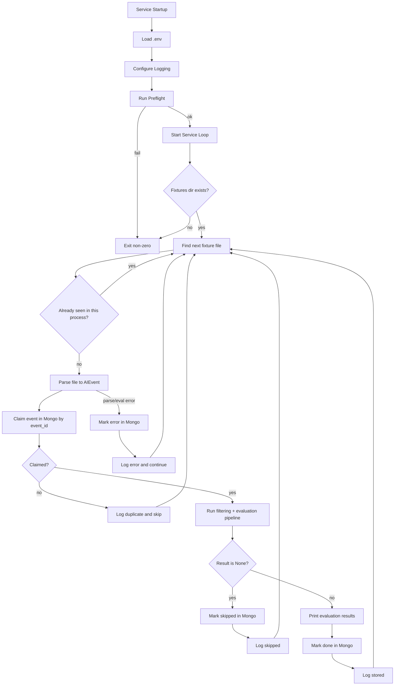
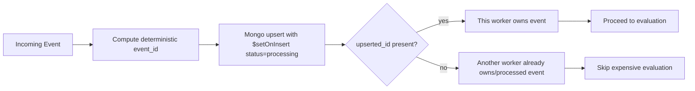
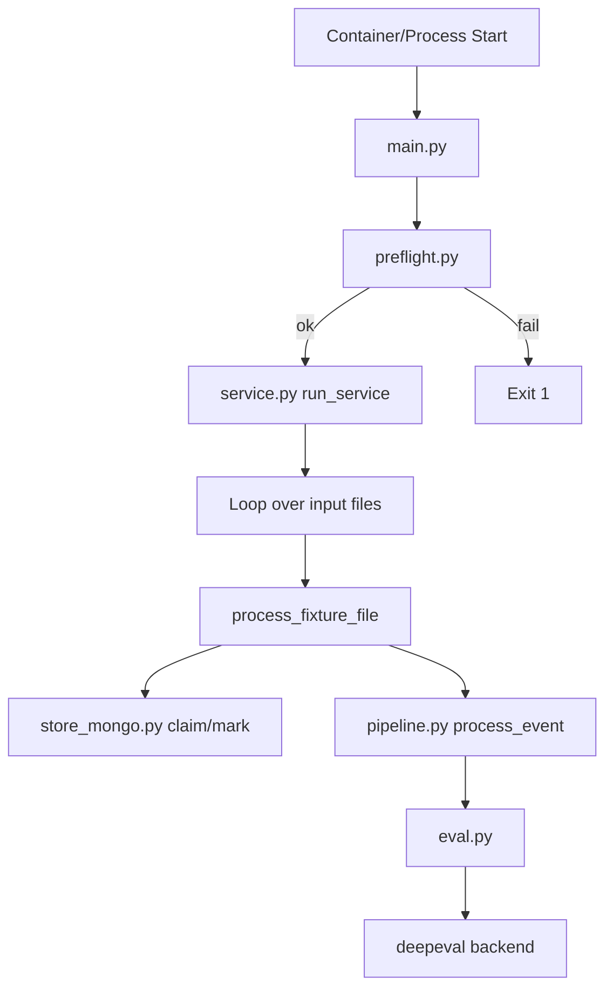

# Flowcharts

## End-to-End Processing Flow

```mermaid
flowchart TD
    A[Service Startup] --> B[Load .env]
    B --> C[Configure Logging]
    C --> D[Run Preflight]
    D -->|fail| X[Exit non-zero]
    D -->|ok| E[Start Service Loop]

    E --> F{Fixtures dir exists?}
    F -->|no| X
    F -->|yes| G[Find next fixture file]
    G --> H{Already seen in this process?}
    H -->|yes| G
    H -->|no| I[Parse file to AIEvent]

    I --> J[Claim event in Mongo by event_id]
    J --> K{Claimed?}
    K -->|no| L[Log duplicate and skip]
    L --> G

    K -->|yes| M[Run filtering + evaluation pipeline]
    M --> N{Result is None?}
    N -->|yes| O[Mark skipped in Mongo]
    O --> P[Log skipped]
    P --> G

    N -->|no| Q[Print evaluation results]
    Q --> R[Mark done in Mongo]
    R --> S[Log stored]
    S --> G

    I -->|parse/eval error| T[Mark error in Mongo]
    T --> U[Log error and continue]
    U --> G
```

## Claim-First Idempotency Flow

```mermaid
flowchart LR
    A[Incoming Event] --> B[Compute deterministic event_id]
    B --> C[Mongo upsert with $setOnInsert status=processing]
    C --> D{upserted_id present?}
    D -->|yes| E[This worker owns event]
    E --> F[Proceed to evaluation]

    D -->|no| G[Another worker already owns/processed event]
    G --> H[Skip expensive evaluation]
```

## Service Lifecycle

```mermaid
flowchart TD
    A[Container/Process Start] --> B[main.py]
    B --> C[preflight.py]
    C -->|ok| D[service.py run_service]
    C -->|fail| E[Exit 1]

    D --> F[Loop over input files]
    F --> G[process_fixture_file]
    G --> H[store_mongo.py claim/mark]
    G --> I[pipeline.py process_event]
    I --> J[eval.py]
    J --> K[deepeval backend]
```
