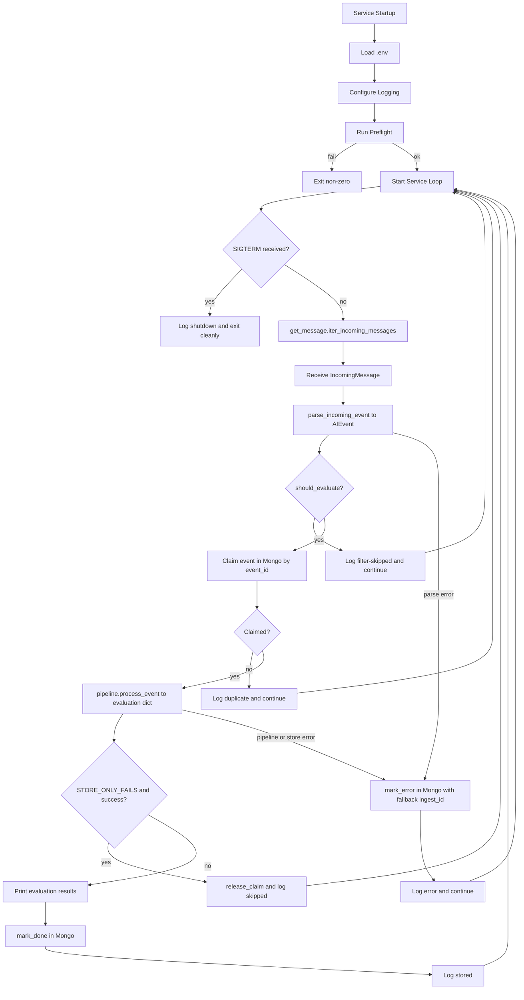
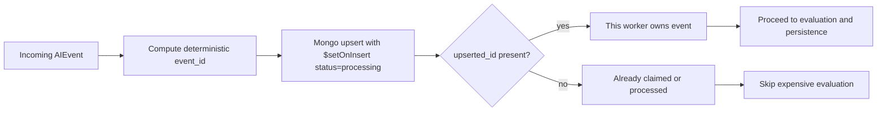
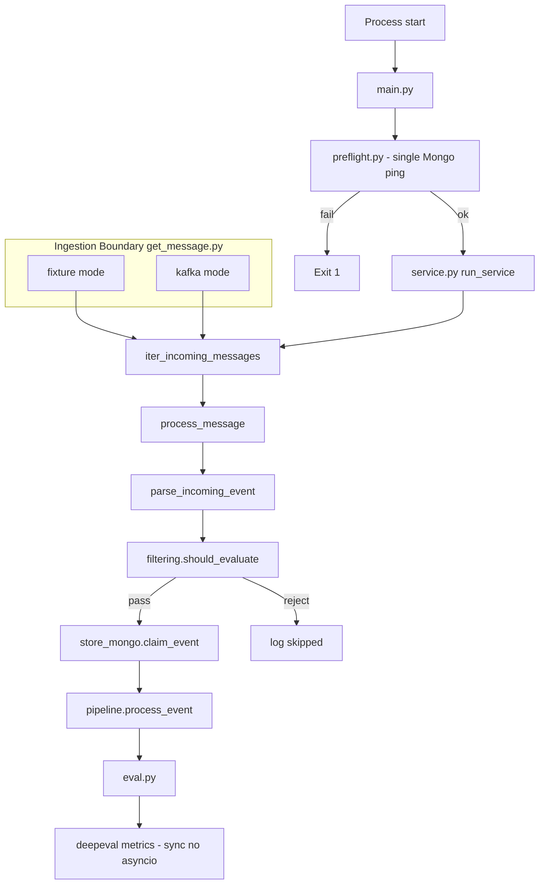

# Flowcharts

## End-to-End Processing Flow

```mermaid
flowchart TD
    A[Service Startup] --> B[Load .env]
    B --> C[Configure Logging]
    C --> D[Run Preflight]
    D -->|fail| X[Exit non-zero]
    D -->|ok| E[Start Service Loop]

    E --> SIG{SIGTERM received?}
    SIG -->|yes| STOP[Log shutdown and exit cleanly]
    SIG -->|no| F[get_message.iter_incoming_messages]

    F --> G[Receive IncomingMessage]
    G --> H[parse_incoming_event to AIEvent]

    H --> FILT{should_evaluate?}
    FILT -->|no| FSKIP[Log filter-skipped and continue]
    FSKIP --> E

    FILT -->|yes| J[Claim event in Mongo by event_id]
    J --> K{Claimed?}
    K -->|no| L[Log duplicate and continue]
    L --> E

    K -->|yes| M[pipeline.process_event to evaluation dict]

    M --> SOF{STORE_ONLY_FAILS and success?}
    SOF -->|yes| REL[release_claim and log skipped]
    REL --> E

    SOF -->|no| Q[Print evaluation results]
    Q --> R[mark_done in Mongo]
    R --> S[Log stored]
    S --> E

    H -->|parse error| T[mark_error in Mongo with fallback ingest_id]
    M -->|pipeline or store error| T
    T --> U[Log error and continue]
    U --> E
```

## Claim-First Idempotency Flow

```mermaid
flowchart LR
    A[Incoming AIEvent] --> B[Compute deterministic event_id]
    B --> C[Mongo upsert with $setOnInsert status=processing]
    C --> D{upserted_id present?}
    D -->|yes| E[This worker owns event]
    E --> F[Proceed to evaluation and persistence]

    D -->|no| G[Already claimed or processed]
    G --> H[Skip expensive evaluation]
```

## Source-Agnostic Service Lifecycle

```mermaid
flowchart TD
    A[Process start] --> B[main.py]
    B --> C[preflight.py - single Mongo ping]
    C -->|ok| D[service.py run_service]
    C -->|fail| E[Exit 1]

    subgraph Ingestion Boundary get_message.py
      F1[fixture mode]
      F2[kafka mode]
    end

    F1 --> G[iter_incoming_messages]
    F2 --> G

    D --> G
    G --> H[process_message]
    H --> I[parse_incoming_event]
    I --> FIL[filtering.should_evaluate]
    FIL -->|pass| J[store_mongo.claim_event]
    J --> K[pipeline.process_event]
    K --> L[eval.py]
    L --> M[deepeval metrics - sync no asyncio]
    FIL -->|reject| SKIP[log skipped]
```
