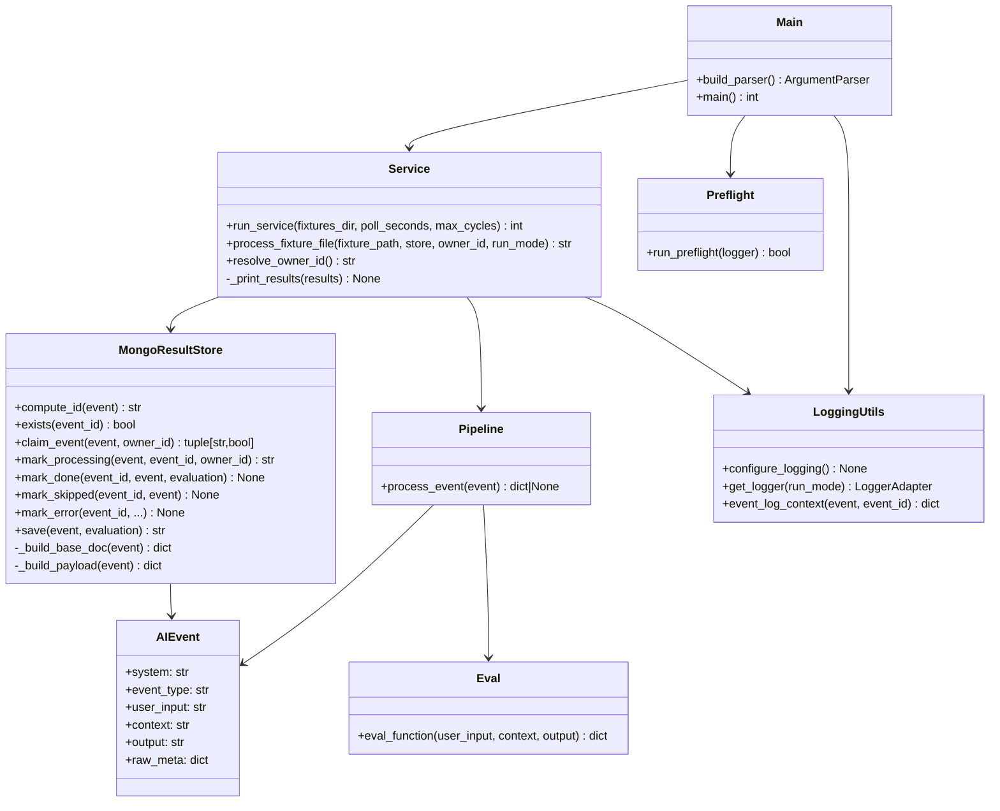
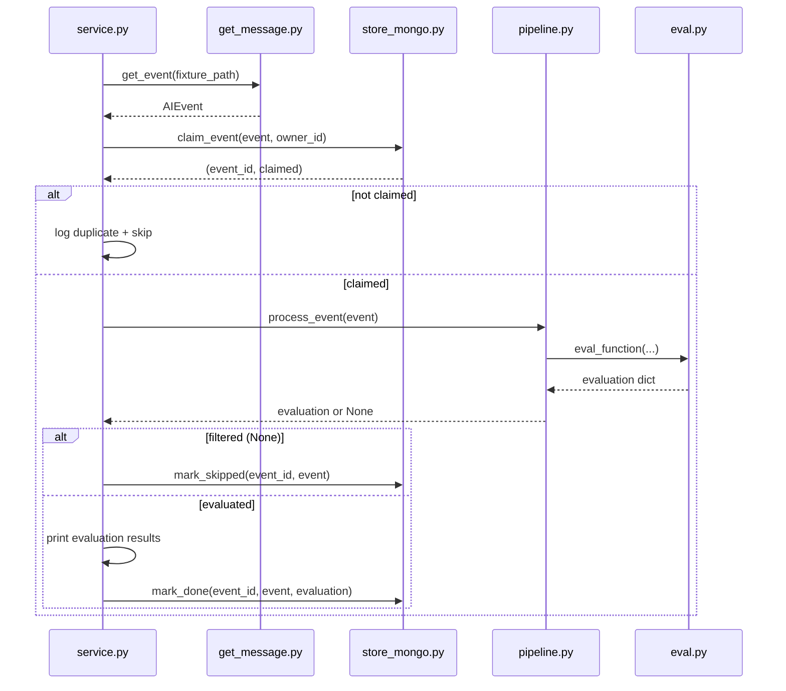
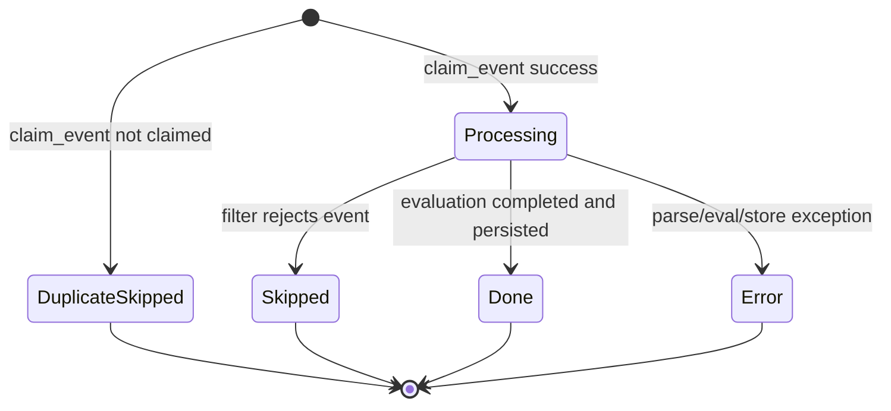

# UML Design Artifacts

## UML Class Diagram (Core Modules)

```mermaid
classDiagram
    class AIEvent {
      +system: str
      +event_type: str
      +user_input: str
      +context: str
      +output: str
      +raw_meta: dict
    }

    class MongoResultStore {
      +compute_id(event) str
      +exists(event_id) bool
      +claim_event(event, owner_id) tuple[str,bool]
      +mark_processing(event, event_id, owner_id) str
      +mark_done(event_id, event, evaluation) None
      +mark_skipped(event_id, event) None
      +mark_error(event_id, ...) None
      +save(event, evaluation) str
      -_build_base_doc(event) dict
      -_build_payload(event) dict
    }

    class Service {
      +run_service(fixtures_dir, poll_seconds, max_cycles) int
      +process_fixture_file(fixture_path, store, owner_id, run_mode) str
      +resolve_owner_id() str
      -_print_results(results) None
    }

    class Pipeline {
      +process_event(event) dict|None
    }

    class Eval {
      +eval_function(user_input, context, output) dict
    }

    class Preflight {
      +run_preflight(logger) bool
    }

    class LoggingUtils {
      +configure_logging() None
      +get_logger(run_mode) LoggerAdapter
      +event_log_context(event, event_id) dict
    }

    class Main {
      +build_parser() ArgumentParser
      +main() int
    }

    Main --> Preflight
    Main --> LoggingUtils
    Main --> Service

    Service --> MongoResultStore
    Service --> Pipeline
    Service --> LoggingUtils

    Pipeline --> Eval
    Pipeline --> AIEvent

    MongoResultStore --> AIEvent
```

## Sequence Diagram (Single Event)

```mermaid
sequenceDiagram
    participant S as service.py
    participant GM as get_message.py
    participant DB as store_mongo.py
    participant P as pipeline.py
    participant E as eval.py

    S->>GM: get_event(fixture_path)
    GM-->>S: AIEvent

    S->>DB: claim_event(event, owner_id)
    DB-->>S: (event_id, claimed)

    alt not claimed
        S->>S: log duplicate + skip
    else claimed
        S->>P: process_event(event)
        P->>E: eval_function(...)
        E-->>P: evaluation dict
        P-->>S: evaluation or None

        alt filtered (None)
            S->>DB: mark_skipped(event_id, event)
        else evaluated
            S->>S: print evaluation results
            S->>DB: mark_done(event_id, event, evaluation)
        end
    end
```

## State Diagram (Event Persistence Status)

```mermaid
stateDiagram-v2
    [*] --> Processing: claim_event success
    [*] --> DuplicateSkipped: claim_event not claimed

    Processing --> Skipped: filter rejects event
    Processing --> Done: evaluation completed and persisted
    Processing --> Error: parse/eval/store exception

    DuplicateSkipped --> [*]
    Skipped --> [*]
    Done --> [*]
    Error --> [*]
```
